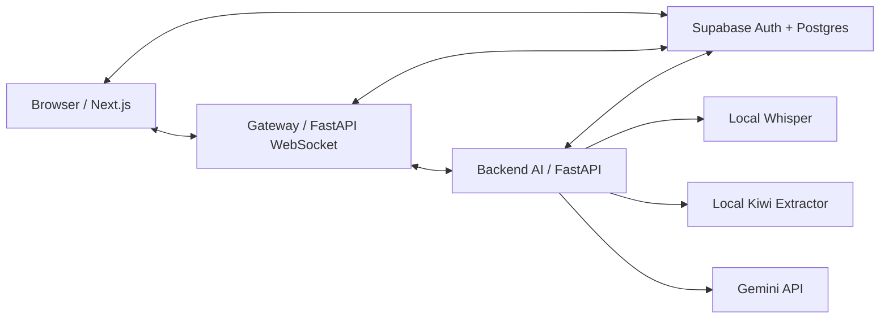

# IMMS-AI

실시간 회의 음성을 전사하고, AI가 아이디어를 구조화해 문제정의와 최종 요약까지 이어주는 협업 캔버스입니다. 일반 회의 흐름뿐 아니라 짧은 발표/체험 세션을 위한 **A/B 밸런스게임 데모 모드**도 포함합니다.

## 프로젝트 개요

IMMS-AI는 회의 중 흩어지는 발화를 실시간으로 수집하고, 팀이 같은 화면에서 아이디어 흐름을 볼 수 있도록 돕는 회의 지능화 시스템입니다.

- 회의 음성을 Whisper로 전사하고 Supabase에 저장합니다.
- 아이디어 단계에서는 키워드 버블을 서버 기준으로 동기화합니다.
- 문제정의 단계에서는 AI가 발화를 주제/의견 단위로 구조화합니다.
- 요약 및 정리 단계에서는 회의 내용을 문서 형태로 정리합니다.
- 데모 밸런스게임 모드에서는 A/B 선택지에 대한 의견을 빠르게 버블로 시각화하고, 최종 판정 리포트를 생성합니다.

## 주요 기능

### 일반 회의 모드

- **실시간 STT**: 브라우저 마이크 입력을 WAV chunk로 전송하고 Whisper로 한국어 전사를 수행합니다.
- **아이디어 버블 캔버스**: 자주 등장하는 핵심 명사/명사구를 서버 그래프 기준으로 배치해 모든 클라이언트가 같은 버블 구조를 봅니다.
- **문제정의 1/2단계**: 전체 전사를 기반으로 논점을 1차 분류하고, 관련 분류를 그룹화합니다.
- **요약 및 정리**: 전사와 구조화 결과를 바탕으로 최종 문서 블록을 생성하고 수정/저장할 수 있습니다.
- **멀티 클라이언트 동기화**: WebSocket과 graph version 기반 sync로 여러 브라우저가 같은 회의 상태를 공유합니다.

### 데모 밸런스게임 모드

짧은 시연 세션을 위해 최적화된 모드입니다.

- 회의 생성 시 `A 선택지`, `A 중심 키워드`, `B 선택지`, `B 중심 키워드`를 입력합니다.
- Whisper raw STT가 들어오면 Kiwi 기반 local fast keyword extractor가 즉시 provisional 버블을 생성합니다.
- A/B orbit에 버블을 배치하고, 서버가 위치/상태/version을 관리합니다.
- Gemini consolidate가 주기적으로 기존 버블의 표기 보정, 병합, 삭제, A/B 이동만 수행합니다.
- 문제정의 단계에서는 A/B 의견 카드로 바로 정리합니다.
- 요약 단계에서는 유효 의견 비율, 주요 근거, 설득력 matrix, 최종 판정을 생성합니다.

### 대시보드와 접근성

- 로그인, 회원가입, 게스트 로그인 흐름을 제공합니다.
- 대시보드에서 회의 목록, 회의 삭제, 시연용 회의 템플릿을 관리합니다.
- 회의 템플릿은 브라우저 `localStorage`에 저장되며, 클릭 시 같은 A/B 설정으로 새 데모 회의를 생성합니다.
- 모바일 회의실은 읽기 전용 화면으로 제공하며, 캔버스 이동/확대/축소와 단계 전환을 지원합니다.

## 아키텍처



### 일반 STT 처리 흐름

```text
마이크 입력
→ Frontend AudioRecorder가 WAV chunk 생성
→ Gateway가 오디오 chunk queue/fusion 처리
→ Backend Whisper STT
→ 전사 결과 저장 및 WebSocket broadcast
→ 아이디어 버블 / 문제정의 / 요약 생성에 활용
```

### 데모 버블 처리 흐름

```text
Whisper raw STT
→ Kiwi local_fast_keywords
→ A/B orbit 버블 graph 갱신
→ WebSocket으로 모든 클라이언트 동기화
→ Gemini consolidate가 기존 버블 rename/merge/remove/move 정리
```

## 기술 스택

| 영역 | 기술 |
| --- | --- |
| Frontend | Next.js 16, React 19, TypeScript, Tailwind CSS, React Flow |
| Gateway | FastAPI, WebSocket, httpx |
| Backend AI | FastAPI, Whisper, Gemini, Kiwi |
| Database/Auth | Supabase Auth, Supabase Postgres |
| Realtime Sync | WebSocket broadcast, canvas graph versioning |
| Test/Report | Playwright smoke script, evaluation report script |

## 프로젝트 구조

```text
IMMS-AI/
├── backend/                    # AI API, Whisper/STT, Gemini 호출, canvas graph 처리
│   └── api.py
├── gateway/                    # WebSocket gateway, auth/meeting API, STT queue
│   ├── main.py
│   └── routers/
│       └── websocket.py
├── frontend/                   # Next.js application
│   ├── app/                    # App Router pages
│   ├── components/canvas/      # 회의 캔버스, 버블, 문제정의, 요약 UI
│   ├── components/dashboard/   # 대시보드 및 회의 템플릿 UI
│   └── scripts/                # smoke/evaluation scripts
├── output/                     # 로컬 실행 로그/리포트 출력
├── llm_client.py               # Gemini client helper
├── run_dev.py                  # backend + gateway + frontend 동시 실행
├── requirements.txt            # Python dependencies
├── supabase_schema.sql         # Supabase schema
└── README.md
```

## 로컬 개발 환경

### 필요 도구

- Python 3.13 이상
- Node.js 20 이상
- npm
- Supabase 프로젝트
- Gemini API key
- FFmpeg가 설치된 환경 권장

Whisper는 로컬에서 실행됩니다. GPU가 있으면 STT 속도가 더 안정적이며, CPU에서도 실행은 가능하지만 지연이 커질 수 있습니다.

### Python 의존성 설치

```powershell
pip install -r requirements.txt
```

가상환경을 사용하는 경우:

```powershell
python -m venv .venv
.\.venv\Scripts\Activate.ps1
pip install -r requirements.txt
```

### Frontend 의존성 설치

```powershell
cd frontend
npm install
cd ..
```

## 환경 변수

민감정보는 저장소에 커밋하지 않습니다. 아래 값은 예시이며 실제 값은 각 환경의 `.env` 파일에만 설정합니다.

### 루트 `.env`

```env
GEMINI_API_KEY=your_gemini_api_key
GEMINI_BASE_URL=https://generativelanguage.googleapis.com/v1beta
GEMINI_MODEL=gemini-3.1-flash-lite
GEMINI_FAST_MODEL=gemini-3.1-flash-lite
GEMINI_FAST_THINKING_LEVEL=low

WHISPER_MODEL=turbo
WHISPER_LANGUAGE=ko

BACKEND_PORT=8000
GATEWAY_PORT=8001
FRONTEND_PORT=5173

DEMO_BUBBLE_LLM_FILE_LOG=1
```

### `gateway/.env`

```env
SUPABASE_URL=your_supabase_url
SUPABASE_KEY=your_supabase_anon_key
SUPABASE_SERVICE_ROLE_KEY=your_supabase_service_role_key

AI_MODULE_URL=http://localhost:8000
GATEWAY_HOST=0.0.0.0
GATEWAY_PORT=8001

JWT_SECRET=your_jwt_secret
JWT_ALGORITHM=HS256

CORS_ORIGINS=["http://localhost:5173","http://127.0.0.1:5173","http://localhost:3000"]
```

### `frontend/.env.local`

```env
NEXT_PUBLIC_SUPABASE_URL=your_supabase_url
NEXT_PUBLIC_SUPABASE_ANON_KEY=your_supabase_anon_key
NEXT_PUBLIC_API_BASE_URL=http://localhost:8000
NEXT_PUBLIC_GATEWAY_URL=http://localhost:8001/gateway
NEXT_PUBLIC_GATEWAY_WS_URL=ws://localhost:8001/gateway/ws
```

`python run_dev.py`는 실행 중 frontend의 backend/gateway URL을 현재 포트에 맞춰 주입합니다. Supabase 관련 `NEXT_PUBLIC_*` 값은 별도로 설정해야 합니다.

## Supabase 설정

Supabase SQL Editor에서 `supabase_schema.sql`을 실행해 필요한 테이블과 정책을 적용합니다.

```text
supabase_schema.sql
```

로컬에서 로그인, 회의 생성, 전사 저장, 캔버스 동기화가 동작하려면 Supabase anon key와 service role key가 모두 필요합니다.

## 실행

권장 실행 방식:

```powershell
python run_dev.py
```

`run_dev.py`는 다음 서비스를 함께 실행합니다.

- Backend AI: `http://127.0.0.1:8000`
- Gateway: `http://127.0.0.1:8001`
- Frontend: `http://127.0.0.1:5173`

포트가 이미 사용 중이면 가능한 포트를 찾아 실행하고, frontend 환경 변수도 해당 포트로 맞춥니다.

수동 실행이 필요한 경우:

```powershell
python -m uvicorn backend.api:app --host 127.0.0.1 --port 8000 --reload
python -m uvicorn gateway.main:app --host 127.0.0.1 --port 8001 --reload
cd frontend
npm run dev -- --hostname 127.0.0.1 --port 5173
```

## 사용 흐름

### 일반 회의

1. `/login` 또는 `/register`에서 인증합니다.
2. `/dashboard`에서 회의를 생성하거나 기존 회의에 입장합니다.
3. 회의실에서 마이크를 시작하면 STT가 저장되고 캔버스에 반영됩니다.
4. 아이디어 단계에서 버블 그래프가 갱신됩니다.
5. 문제정의 1단계/2단계에서 AI 구조화를 생성합니다.
6. 요약 및 정리 단계에서 최종 문서를 생성하고 저장합니다.

### 데모 밸런스게임

1. 대시보드에서 시연용 밸런스게임 회의를 생성합니다.
2. `A 선택지`, `A 중심 키워드`, `B 선택지`, `B 중심 키워드`를 입력합니다.
3. 참가자가 짧게 발화하면 STT와 버블이 빠르게 갱신됩니다.
4. 문제정의 단계에서 A/B 의견 카드가 생성됩니다.
5. 요약 단계에서 유효 의견 비율과 최종 판정 리포트가 생성됩니다.

## 검증 명령

Python syntax check:

```powershell
.\.venv\Scripts\python.exe -m py_compile backend\api.py gateway\routers\websocket.py
```

Frontend type/build check:

```powershell
cd frontend
npx.cmd tsc --noEmit --incremental false
npm.cmd run build
```

멀티 클라이언트 캔버스 smoke test:

```powershell
cd frontend
npm run smoke:multiclient-canvas -- --meeting-id=<meeting-id> --clients=5 --trigger=both --enter-watchers
```

평가 리포트:

```powershell
cd frontend
npm run report:evaluation -- --help
```

## 디버깅 메모

- Next.js dev server lock이 남아 있으면 `frontend\.next\dev\lock` 때문에 `run_dev.py`가 실행되지 않을 수 있습니다. 기존 `next dev` 또는 `run_dev.py` 프로세스를 먼저 종료하세요.
- 데모 버블 LLM 요청/응답 JSONL 로그는 기본적으로 `output\demo-bubble-llm\<meeting-id>.jsonl`에 저장됩니다.
- 멀티 클라이언트 smoke test 결과는 `output\playwright\multiclient-canvas-smoke` 아래에 저장됩니다.
- STT 지연은 backend 로그의 Whisper 처리 시간, gateway의 audio queue 로그, frontend 콘솔의 STT chunk 로그를 함께 확인합니다.
- 데모 버블이 보이지 않을 때는 `local_fast_keywords`, `consolidate`, `bubble_graph_updated` 로그를 우선 확인합니다.

## 라이선스

MIT License
